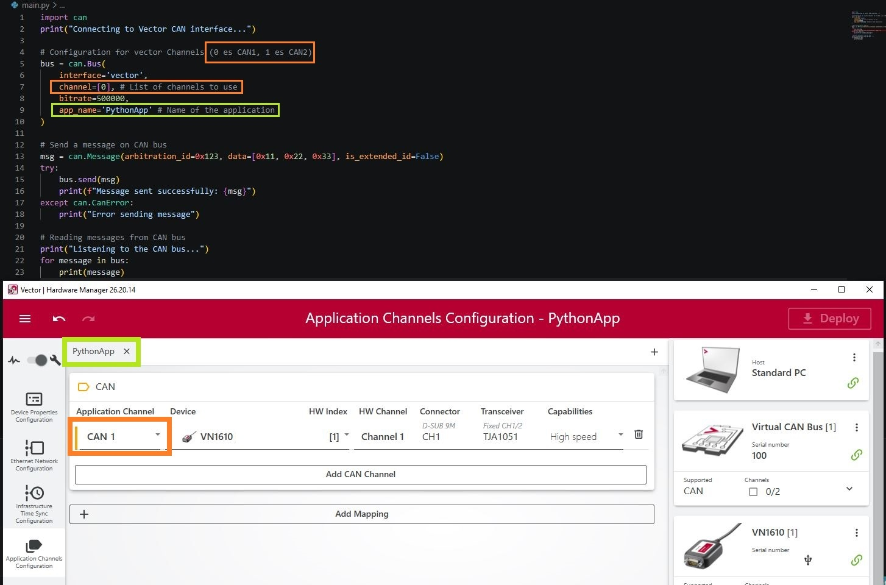
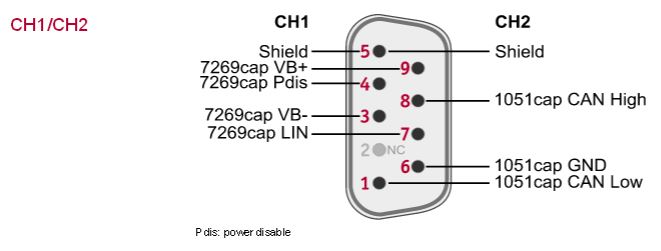

# Install Vector Driver Setup
This make VN1610 discoverable in windows.
https://www.vector.com/int/en/download/vector-driver-setup-26-20-0-for-windows-10-and-11/

# Install XL Driver Library
This make possible to connect python with VN1610.
https://www.vector.com/int/en/download/xl-driver-library/

# Verify that these data is correctly set

# Verify pinout connections

